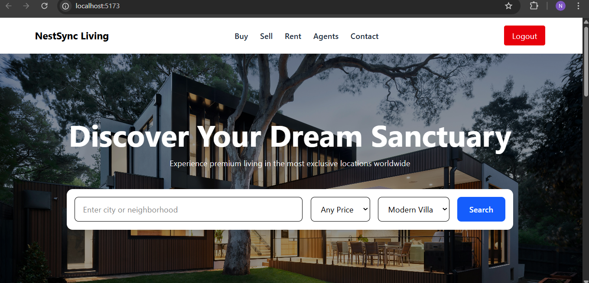
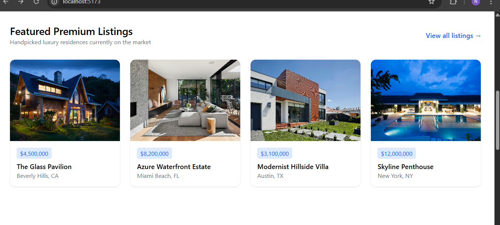
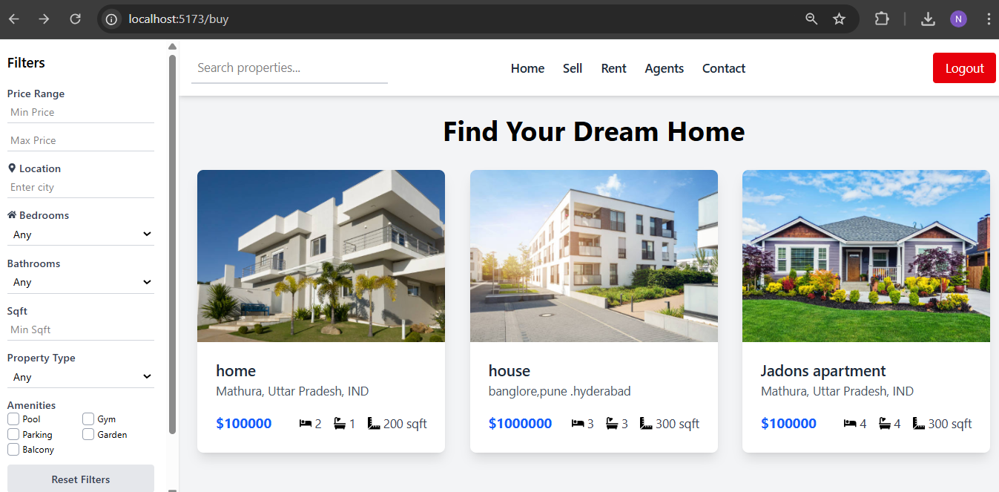

# 🏡 NestSync Living – Smart Real Estate Platform

NestSync Living is a **full-fledged MERN + Machine Learning based real estate web application** that allows users to **buy and sell properties**, explore listings by **location, type, and price**, and make secure transactions using **PayPal integration**.
The platform also leverages **Machine Learning models** for **property recommendation, fraud detection, and price prediction**, making it an intelligent and secure real-estate solution.

---

## 📌 Features

### 🏠 Property Management

* List properties for sale with:

  * Property type
  * Location
  * Price
  * Images
* Browse and search properties easily
* View detailed property pages

### 👤 Authentication & Security

* Secure user authentication (login/signup)
* Role-based access (Buyer & Seller)
* Protected routes
* Secure session handling

### 💳 Payment Integration

* PayPal payment gateway for secure transactions

### 🤖 Machine Learning Integration

* **Recommendation System** – suggests properties based on user behavior
* **Fraud Detection Model** – identifies suspicious listings
* **Price Prediction Model** – predicts property prices based on features like:

  * Location
  * Property type
  * Size
  * Bedrooms
  * Bathrooms

### 🧠 Smart Filtering

* Filter by:

  * Price
  * Location
  * Property type
  * Search keywords

---

## 🛠 Tech Stack

### Frontend

* React.js
* Tailwind CSS
* Axios

### Backend

* Node.js
* Express.js
* MongoDB

### Machine Learning

* Python
* Scikit-learn / Pandas / NumPy
* Custom trained models for:

  * Recommendation
  * Fraud detection
  * Price prediction

### Payment

* PayPal API

---

## 📂 Project Structure

```
NestSync-Living/
│
├── backend/          # Node.js + Express backend
├── ml/               # Machine learning models
├── real-estate-app/  # React frontend
├── Images/           # Project screenshots
├── README.md
```

---

## 🖼️ Project Screenshots




> (All screenshots are stored in the `Images` folder.)


## 🎯 Use Cases

* Buyers can:

  * Search & explore properties
  * View recommendations
  * Make payments

* Sellers can:

  * List properties
  * Manage their listings

* System:

  * Predicts prices
  * Detects fraud
  * Recommends properties

---

## 🌟 Highlights

✅ Full MERN stack application
✅ Machine Learning integrated
✅ Secure authentication
✅ PayPal payments
✅ Intelligent recommendation system
✅ Fraud detection
✅ Price prediction
✅ Clean UI with modern design

---

## 👩‍💻 Author

**Neha Singh**
B.Tech Computer Science Student
Project: *NestSync Living – Smart Real Estate Platform*

---

## 📜 License

This project is licensed for educational and personal use.

